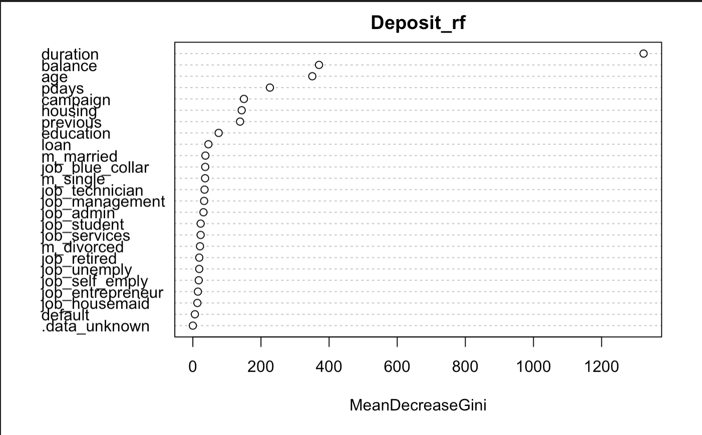

```{r setup, include=FALSE}
knitr::opts_chunk$set(echo = TRUE)
library(tidyverse)
library(dplyr)
library(ggplot2)
library(readxl)
library(dummies)    
library(philentropy)
library(skimr)     
library(cluster)    ## datasets and utilities for clustering, along with some algos
library(factoextra)    ## clustering visualization utilities
library(dendextend)     ## for working with dendrograms
library(devtools) 
# install.packages("gbm")
# install.packages("rpart.plot")
# install.packages("glmnet")
library(randomForest)
library(gbm)
library(rpart.plot)
library(rpart)
library(dplyr)
library(readr)
library(tidyverse) 
library(ggplot2) 
library(ggthemes)
library(glmnet)
library(MASS)
library(caret) # models
library(corrplot) # correlation plots
library(DALEX) # explain models
library(DescTools) # plots
library(doParallel) # parellel processing
library(dplyr) # syntax
library(inspectdf) # data overview
library(readr) # quick load
library(sjPlot) # contingency tables
library(tabplot) # data overview
library(tictoc) # measure time
library(MLmetrics)
```

Except the unsupervised part, our group attempt the supervised machine learning to explain  this dataset. Since the outcome (“deposit”) is a binary outcome, the Binary Classification method can be applied to choose the best model from Logistic Regression, Random Forest and eXtreme Gradient Boosting (XGBoosting). In this section, XGBoost is applied instead of Boosting because it is an implementation of gradient boosted decision trees designed for speed and performance.

After those three models were trained and making predictions, a confusion matrix is used to describe the performance of a classification model. Two key performance metrics were chosen to compare model performance: AUC and F score. AUC (Area Under The Curve) - ROC (Receiver Operating Characteristics) curve is a performance measurement for classification problem at various thresholds settings. It tells how much model is capable of distinguishing between classes. Higher the AUC, better the model is at distinguishing between customers with deposit and no deposit. Moreover, F Score is a weighted average of the true positive rate (recall) and precision. Higher the F score, better the model is. 

As shown graph below, the XGBoosting has the highest AUC among them and the random forest has the highest F score among them. We are sure that the logistics regression perform  poor for this dataset but we still cannot confirm which is the best between  the remaining two models. 


```{r include=FALSE}
df = read_csv("bank-original.csv")
df$pdays = NULL #Drop the variable `pdays` because it is misleading
df$duration = NULL 
```

```{r}
# Binary Classification method 
# train model
cl <- makePSOCKcluster(4)
registerDoParallel(cl)
# Define model setting 
# train and test 
set.seed(123)
trainIndex <- createDataPartition(df$deposit,
                                  p = 0.8, # training contains 80% of data
                                  list = FALSE)
dfTrain <- df[ trainIndex,]
dfTest  <- df[-trainIndex,]
set.seed(123)
# splitting
control <- trainControl(method = "cv",
                        number = 10,
                        classProbs = TRUE,
                        summaryFunction = multiClassSummary) # return more metrics than binary classification

# parameter grid for XGBoost
parameterGrid <-  expand.grid(eta = 0.1, # shrinkage (learning rate)
                              colsample_bytree = c(0.5,0.7), # subsample ration of columns
                              max_depth = c(3,6), # max tree depth. model complexity
                              nrounds = 10, # boosting iterations
                              gamma = 1, # minimum loss reduction
                              subsample = 0.8, # ratio of the training instances
                              min_child_weight = 2) # minimum sum of instance weight

# parameter grid for random forest
# mtry = the number of features to use to build each tree
rfGrid <- expand.grid(mtry = seq(from = 4, to = 20, by = 4))

# logistic regression
set.seed(123) 
model_glm <- train(deposit~.,
                   data = dfTrain,
                   method = "glm",
                   family = "binomial",    # preProcess = "pca",
                   trControl = control)

# random forest 
set.seed(123)
model_rf <- train(deposit~.,
                  data = dfTrain,
                  method = "rf",
                  ntree = 20,
                  tuneLength = 5,
                  trControl = control,
                  tuneGrid = rfGrid)
# XGBoosting
set.seed(123)
model_xgb <- train(deposit~.,
                   data = dfTrain,
                   method = "xgbTree",
                   trControl = control,
                   tuneGrid = parameterGrid)
stopCluster(cl)

### actual prediction
# Logistic regression
pred_glm_raw <- predict.train(model_glm,
                              newdata = dfTest,
                              type = "raw") # use actual predictions

# Random forest
pred_rf_raw <- predict.train(model_rf,
                             newdata = dfTest,
                             type = "raw")

# XGBoost
pred_xgb_raw <- predict.train(model_xgb,
                              newdata = dfTest,
                              type = "raw")

### Confusion matrices for 3 methods 
confusionMatrix(data = pred_glm_raw,
                factor(dfTest$deposit),
                positive = "yes")

confusionMatrix(data = pred_rf_raw,
                factor(dfTest$deposit),
                positive = "yes")

confusionMatrix(data = pred_xgb_raw,
                factor(dfTest$deposit),
                positive = "yes")
### choose the final model from these three
model_list <- list(logistic_regression = model_glm,
                   random_forest = model_rf,
                   XGBoosting = model_xgb)

res <- resamples(model_list)
# Plot model results -  AUC, and F1
# Two key performance metrics were chosen to compare model performance.
bwplot(res , metric = c("AUC", "F1"))
```


Furthermore, we had run a t-test to compare model performance. p-value > 0.5 then the models are not statistically different, so we decided to run both models to explain the dataset.
```{r}
# Run a t-test to compare model performance (xbg and rf)
compare_models(model_rf, model_xgb)
```


We see that duration has a high correlation with term deposits meaning the higher the duration, the more likely it is for a client to open a term deposit. The mean duration time is 373s. People who were above the duration status, were more likely to open a term deposit. The factor of age and balance can have impact on deposit as well. The MSE train is 0.0369 and MSE test is 0.1376 which seems reasonable.



```{r include=FALSE}
#  Splitting train and test
bank = read_csv("bankdata_cleaned.csv")
set.seed(123)
bank$train <- sample(c(0, 1), nrow(bank), replace = TRUE, prob = c(.3, .7))
bank$deposit = NULL
bank$job = NULL
bank$marital = NULL
glimpse(bank)
bk_test <- bank %>% filter(train == 0)
bk_train <- bank %>% filter(train == 1) 
bk_train$train = NULL     
bk_test$train = NULL  
```

```{r}
#Random Forest
f1 = as.formula(Deposit ~.)

bk_train$Deposit <- as.character(bk_train$Deposit)
bk_train$Deposit <- as.factor(bk_train$Deposit)
Deposit_rf <- randomForest(f1, bk_train, ntree = 500, do.trace=F) 
yhat_rf_train <- predict(Deposit_rf, bk_train)
mse_rf_train <- mean((yhat_rf_train - bk_train$Deposit) ^2) 
yhat_rf_test <- predict(Deposit_rf, bk_test)
mse_rf_test <- mean((yhat_rf_test - bk_test$Deposit) ^2) 
varImpPlot(Deposit_rf)
mean(bank$duration)

paste("Random Forest Train MSE",mse_rf_train)
paste("Random Forest Train MSE",mse_rf_test)

bank$DurationRange<-findInterval(bank$duration, c(0,100,200,300,400,500,600,800,1000,1500,2000,2500,3000))
bank1 <-bank %>% group_by(DurationRange) %>% summarise(deposit=mean(Deposit))
ggplot(bank1)+geom_col(aes(DurationRange,deposit))+scale_x_discrete(
  limits=c("0","100","200","300","400","500","600","800","1000","1500","2000","2500","3000"))


summary(bank1)
```


From the XGBoost, we got that the most five important variables is `poutcome`, `contact`, `housing`, `loan`.

```{r echo=FALSE}
varImpXGB <- varImp(model_xgb)
top4 <- varImpXGB$importance %>% head(n = 5)
top5 <- rownames(top4)
top5[match('poutcomesuccess', top5)] <- "poutcome"
top5[match('contactunknown', top5)] <- "contact"
top5[match('housingyes', top5)] <- "housing"
top5[match('loanyes', top5)] <- "loan"
cbind(top5,top4)
```


